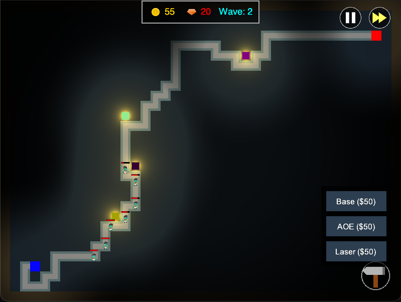

# Steam Tunnels Defense

A procedural Tower Defense game set in the steam tunnels underneath UT Austin. Built with **Python** and the **Arcade** library, featuring custom GLSL shaders for atmospheric lighting and particle effects.



## Features

* **Procedural Map Generation:** Every game features a unique layout with procedurally generated steam tunnels.
* **Dynamic Lighting Engine:** Custom GLSL shaders provide additive blending, glowing projectiles, and a dynamic vignette that reacts to tower placement.
* **Pathfinding:** Enemies navigate complex mazes using BFS pathfinding.
* **Three Unique Towers:**
    * **Base Tower:** Fires high-velocity steam bolts.
    * **AOE Tower:** Launches explosive steam canisters for area damage.
    * **Laser Tower:** Emits a continuous, fading beam of concentrated energy.
* **Wave System:** Difficulty scales over time, expanding the map and adding new spawn/goal points dynamically.

## ️ Installation

1.  **Clone the repository**
    ```bash
    git clone [https://github.com/yourusername/steam-tunnels-defense.git](https://github.com/yourusername/steam-tunnels-defense.git)
    cd steam-tunnels-defense
    ```

2.  **Create a Virtual Environment (Optional but Recommended)**
    ```bash
    python -m venv .venv
    # Windows:
    .venv\Scripts\activate
    # Mac/Linux:
    source .venv/bin/activate
    ```

3.  **Install Dependencies**
    ```bash
    pip install -r requirements.txt
    ```

4.  **Run the Game**
    ```bash
    python run_game.py
    ```

##  Controls

* **Mouse:** Interaction (Click buttons, select towers).
* **Hammer Icon:** Toggle the Build Menu.
* **Left Click (Map):** Place selected tower / Select existing tower to view range.
* **ESC:** Close the game.

##  Project Structure

The project follows a modular architecture separating logic, visuals, and game entities.

```text
Group-14-Final-Project/
├── run_game.py             # Entry point
├── assets/                 # Shaders and Texture resources
└── game/
    ├── views/              # Screen management (Start, Game, Game Over)
    ├── entities/           # Sprites (Towers, Enemies, Tiles)
    ├── managers/           # Logic (GameManager, WaveManager)
    ├── map/                # Procedural generation logic
    └── utils/              # Helper functions and Shader wrappers

